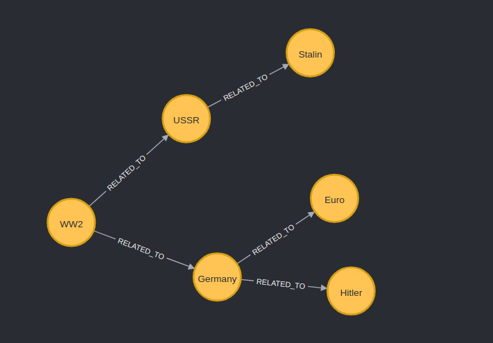

To install dependencies:

```sh
bun install
```

To run:

```sh
bun run dev
```

open http://localhost:3000

## Client

### How to start

in `client` dir run:

```bash
bun run dev
```

- open `http://localhost:5173/`

### Details
It seems that force graph is the appropriate layout

### Tech

- Vite
- React Query (axios) - too lazy not to use axios
- React Router - too lazy to learn anything more meaningful
- react-force-graph-2d - evaluating

## Server

### How to start

in root dir run:

```bash
bun run dev
```

### Tech

- Bun
- Neo4j

## Neo4j

> Disclaimer: I have no idea how to use it, everything is generated with the bot.

When it is installed, you can open its browser on `http://localhost:7474/browser/`
Here is a simple starting query:

```cypher
CREATE (ww2:Item {name: "WW2"}),
       (germany:Item {name: "Germany"}),
       (hitler:Item {name: "Hitler"}),
       (ussr:Item {name: "USSR"}),
       (stalin:Item {name: "Stalin"})

WITH ww2, germany, ussr, hitler, stalin
CREATE (ww2)-[:RELATED_TO]->(germany)
CREATE (ww2)-[:RELATED_TO]->(ussr)
CREATE (germany)-[:RELATED_TO]->(hitler)
CREATE (ussr)-[:RELATED_TO]->(stalin)
```

It is creating this result (ignore Euro, it is added later)

